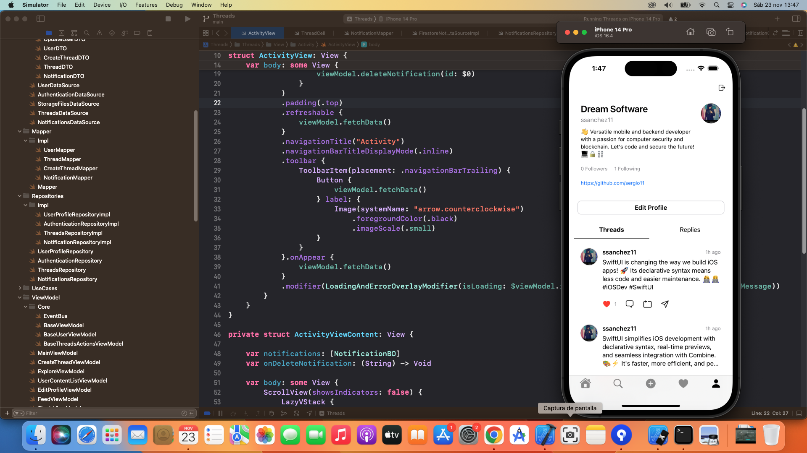
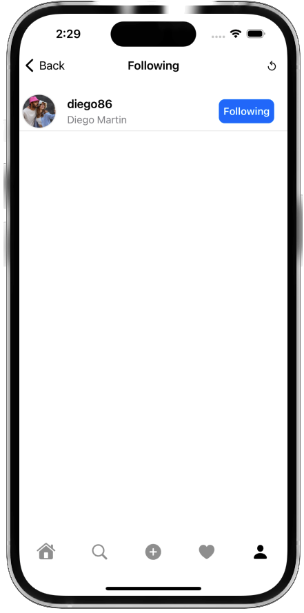
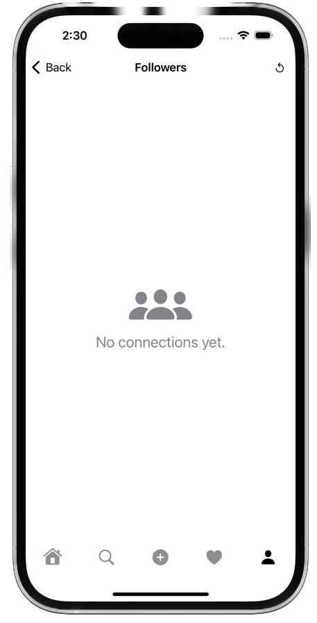

# 🧵 Threads SwiftUI - Where Ideas Connect

Welcome to **Threads SwiftUI** – an intuitive and feature-rich application built for **iOS 17**, designed to provide a seamless platform for users to **share thoughts**, **engage in meaningful conversations**, and comment on **trending topics** across the globe. 🚀💬

This app is powered by **SwiftUI**, Apple's declarative framework for building modern user interfaces, and follows **Clean Code** principles to ensure scalability, maintainability, and high performance. Whether you’re looking to stay updated with the latest trends, share your opinion, or interact with other users, **Threads SwiftUI** is crafted to provide a smooth and enjoyable experience. ✨📱

  
  
  
  
  

## 📚 Project Description

**Threads SwiftUI** is a dynamic iOS application developed with **SwiftUI** and powered by **Firebase** to provide users with a seamless platform to share their thoughts, connect with others, and explore new ideas. Built for **iOS 17**, this app allows users to create, comment, like, and share **Threads**—short posts or thoughts on various topics. 🚀

The app utilizes **Firebase Authentication** to manage user accounts and **Firestore** (Firebase's NoSQL database) to store user data, threads, and interactions in real-time. This ensures a highly responsive and secure experience for users, allowing them to engage with others and track their activity effortlessly.

Users can explore new people, follow them, and get notified when their content receives likes, comments, or shares. Notifications are delivered in real-time, alerting users when someone interacts with their threads or follows them, creating an engaging social environment.

In addition, users have the ability to **personalize their profile**, adding a personal touch to their account and showcasing their unique identity.

## 🔑 Key Features

- **User Authentication**: Users can securely sign up and log in using **Firebase Authentication** 🔐
  
- **Create and Share Threads**: Users can post their thoughts, ideas, and creative content as **Threads**. These threads can be about any topic, and users can freely express their opinions or share updates. 📝💡

- **Engage with Content**: Other users can **like**, **comment**, **share**, and **repost** threads to foster conversation and engagement. 📣❤️

- **Follow Users**: Explore and follow other users to stay updated with their content and thoughts. 📲👥

- **Real-Time Notifications**: The app delivers **real-time notifications** to alert users when someone likes their thread, comments, or follows them. Users can keep track of all interactions in their notification center. 🔔📬

- **Profile Customization**: Users can personalize their profiles by adding images, bio information, and other customizable details to showcase their individuality. 🌟👤

- **Explore New People**: Users can discover other users, follow them, and expand their social network within the app. 🌍🤝

- **Built with Firebase**: The app uses **Firestore** for storing user data, threads, likes, comments, and other interactions in real-time, making it a fast and responsive experience. ⚡🔥

- **Clean Architecture**: The app follows **Clean Code** principles and uses **SwiftUI** for creating modern, maintainable, and scalable user interfaces. 🛠️📐

## 🏗️ Architecture

**Threads SwiftUI** follows a modern **MVVM (Model-View-ViewModel)** pattern combined with **Clean Architecture** principles to provide a scalable, maintainable, and testable application structure. This approach ensures separation of concerns, clear data flow, and easy extensibility as the project grows.

### MVVM + Clean Architecture
- **Model**: Represents the core data structures of the application (e.g., `Notification`, `User`).
- **View**: The SwiftUI views that display the UI components, like `NotificationCell`, `ActivityView`, and `ProfileView`.
- **ViewModel**: Contains the logic for transforming the raw data into something that the View can display. The ViewModel communicates with use cases and interacts with use cases to fetch data.
  
**Clean Architecture** divides the application into **independent layers**:

1. **Use Case Layer**: Contains the application-specific business logic, including the actions users can perform, such as creating a thread, fetching notifications, etc. Each use case is represented by a class that handles a specific feature (e.g., `CreateThreadUseCase`, `FetchNotificationsUseCase`).
   
2. **Repository Layer**: Abstracts the data-fetching logic, providing a unified API for interacting with different data sources. It retrieves and manipulates data through various repositories (e.g., `NotificationsRepository`, `UserRepository`). This layer interacts with external services like Firebase and abstracts Firebase interactions behind a clean interface.

3. **DataSource Layer**: Deals directly with the external data sources (e.g., Firebase, network APIs) and returns the raw data to be passed to the repository layer. This layer abstracts the direct communication with Firebase, ensuring that the repository only interacts with the data layer and does not need to know about its implementation details.

### SwiftUI + Combine
**SwiftUI** is used for building declarative user interfaces, offering a reactive, dynamic, and flexible UI that updates as the data changes. The **Combine** framework is used for reactive programming, allowing us to bind data to views, enabling real-time updates to the user interface. This combination of **SwiftUI** and **Combine** ensures the app reacts to changes in data seamlessly, particularly for features like notifications, likes, and user actions.

### Inversion of Control (IoC) Container with Factory
The application utilizes an **IoC (Inversion of Control) container** with a **Factory** design pattern to manage dependency injection. This allows for better separation of concerns and ensures that the dependencies (such as repositories, use cases, etc.) are injected into the classes that require them. It simplifies unit testing and enhances modularity by making the app more flexible and extensible.

### Firebase Abstraction
To ensure the app remains testable and maintainable, Firebase interactions (e.g., authentication and Firestore) are abstracted through repository and data source layers. Instead of directly using Firebase SDKs throughout the app, all Firebase-related calls are routed through specific **data sources** like `UserDataSource` and `NotificationsDataSource`. This abstraction allows easy switching or mocking of Firebase for testing and future scalability.

## ⚙️ Technologies Used

**Threads SwiftUI** utilizes various modern technologies and libraries to provide a rich, interactive, and high-performance user experience. Below is a list of key technologies and frameworks used in the app:

### Firebase
- **Firestore**: A real-time NoSQL database that stores all user data, threads, notifications, likes, and comments. Firestore allows for real-time data synchronization across devices, enabling seamless user interactions.
- **Firebase Authentication**: Handles secure user sign-in and registration with multiple authentication providers (e.g., email/password, Google, Apple). Firebase Authentication ensures user data is protected and supports scalable authentication methods.

### SwiftUI
- **SwiftUI**: Used for building the entire UI of the app. Its declarative syntax and native integration with iOS allow for easy development and maintenance of UI components.
  
### Combine
- **Combine**: The reactive framework that integrates with SwiftUI to manage state changes. Combine enables binding data to views and handling asynchronous events, like network calls and real-time updates.

### IoC Container & Factory Pattern
- **IoC Container**: The app leverages an IoC container to manage dependencies and handle the injection of services like repositories, use cases, and data sources, making the architecture more modular and testable.
- **Factory Pattern**: The Factory pattern is used in combination with the IoC container to create instances of required objects and services, providing better separation of concerns and flexibility.

### UI Libraries & Tools
- **Kingfisher**: A powerful image downloading and caching library for Swift. Kingfisher is used for handling profile images and other images in the app, ensuring they are efficiently cached and loaded asynchronously.
  
- **SwipeActions**: A native SwiftUI feature that enables swipe actions on rows, allowing users to delete or perform actions like marking notifications as read. The swipe actions are enhanced to provide a clean and intuitive UX.

### Other Frameworks
- **UIKit**: While **SwiftUI** is the primary UI framework, **UIKit** is also used for certain UI elements (e.g., custom image views, gesture recognizers) where SwiftUI lacks support.

## App Screenshots

Here are some screenshots from our app to give you a glimpse of its design and functionality.

## Contributing 🤝

Contributions are welcome! If you'd like to contribute to ThreadsSwiftUI, please fork the repository and create a pull request with your changes.

## Support 💬

For support, bug reports, or feature requests, please open an issue on the GitHub repository.

## License 📄

ThreadsSwiftUI is available under the MIT License. See the [LICENSE](LICENSE) file for more information.

## Acknowledgements 🙏

ThreadsSwiftUI is inspired by the functionality and design of Threads from Meta.

We express our deep appreciation to [Freepik](https://www.freepik.es/) for generously providing the resources used in this project.

 ## Visitors Count

## Please Share & Star the repository to keep me motivated.

Template mockup from https://previewed.app/template/AFC0B4CB
