# 🧵 Threads SwiftUI - Where Ideas Connect

Welcome to **Threads SwiftUI** – an intuitive and feature-rich application built for **iOS 17**, designed to provide a seamless platform for users to **share thoughts**, **engage in meaningful conversations**, and comment on **trending topics** across the globe. 🚀💬

This app is powered by **SwiftUI**, Apple's declarative framework for building modern user interfaces, and follows **Clean Code** principles to ensure scalability, maintainability, and high performance. Whether you’re looking to stay updated with the latest trends, share your opinion, or interact with other users, **Threads SwiftUI** is crafted to provide a smooth and enjoyable experience. ✨📱

  
  
  
  
  

## 📚 Project Description

**Threads SwiftUI** is a dynamic iOS application developed with **SwiftUI** and powered by **Firebase** to provide users with a seamless platform to share their thoughts, connect with others, and explore new ideas. Built for **iOS 17**, this app allows users to create, comment, like, and share **Threads**—short posts or thoughts on various topics. 🚀

The app utilizes **Firebase Authentication** to manage user accounts and **Firestore** (Firebase's NoSQL database) to store user data, threads, and interactions in real-time. This ensures a highly responsive and secure experience for users, allowing them to engage with others and track their activity effortlessly.

Users can explore new people, follow them, and get notified when their content receives likes, comments, or shares. Notifications are delivered in real-time, alerting users when someone interacts with their threads or follows them, creating an engaging social environment.

In addition, users have the ability to **personalize their profile**, adding a personal touch to their account and showcasing their unique identity.

## 🔑 Key Features

- **User Authentication**: Users can securely sign up and log in using **Firebase Authentication** 🔐
  
- **Create and Share Threads**: Users can post their thoughts, ideas, and creative content as **Threads**. These threads can be about any topic, and users can freely express their opinions or share updates. 📝💡

- **Engage with Content**: Other users can **like**, **comment**, **share**, and **repost** threads to foster conversation and engagement. 📣❤️

- **Follow Users**: Explore and follow other users to stay updated with their content and thoughts. 📲👥

- **Real-Time Notifications**: The app delivers **real-time notifications** to alert users when someone likes their thread, comments, or follows them. Users can keep track of all interactions in their notification center. 🔔📬

- **Profile Customization**: Users can personalize their profiles by adding images, bio information, and other customizable details to showcase their individuality. 🌟👤

- **Explore New People**: Users can discover other users, follow them, and expand their social network within the app. 🌍🤝

- **Built with Firebase**: The app uses **Firestore** for storing user data, threads, likes, comments, and other interactions in real-time, making it a fast and responsive experience. ⚡🔥

- **Clean Architecture**: The app follows **Clean Code** principles and uses **SwiftUI** for creating modern, maintainable, and scalable user interfaces. 🛠️📐

## 🛠️ Architecture

Threads SwiftUI is built using the **Clean Code** architecture, ensuring maintainable and scalable code. Here’s a brief overview of the architecture components:

- **Use Cases**: Encapsulate the business logic and define the actions the app can perform.
- **Repositories**: Provide a clean API for data access and manipulation.
- **Data Sources**: Manage data from various sources such as remote APIs (Firebase) and local storage.

## 🔧 Technologies

- **SwiftUI**: For building the user interface.
- **Firebase Authentication**: For secure user authentication.
- **Firestore**: For real-time database and data synchronization.
- **Firebase Storage**: For storing user-generated content.

## App Screenshots

Here are some screenshots from our app to give you a glimpse of its design and functionality.

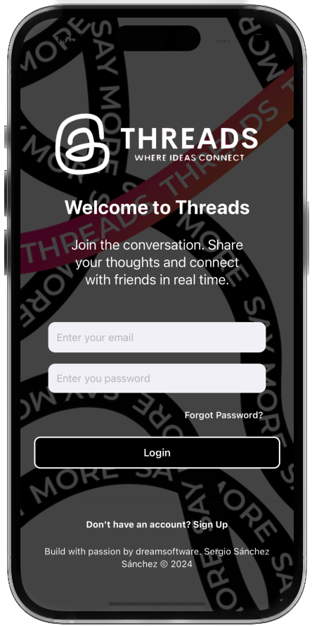

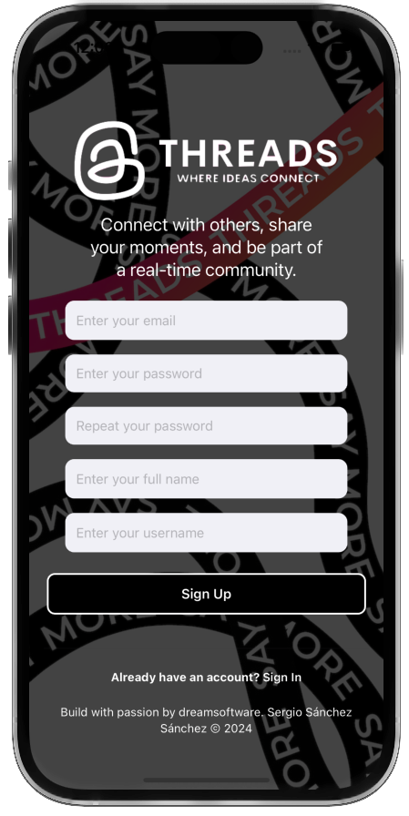

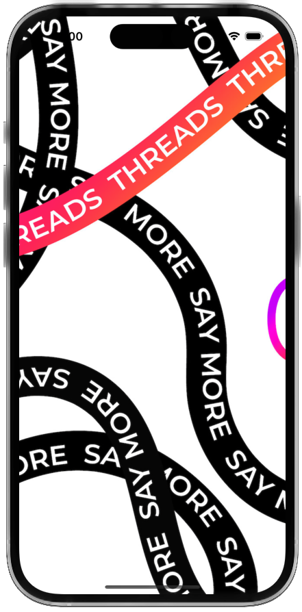
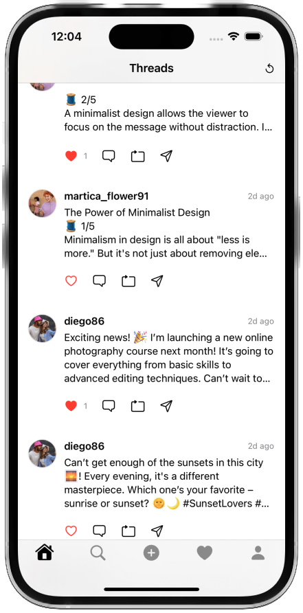

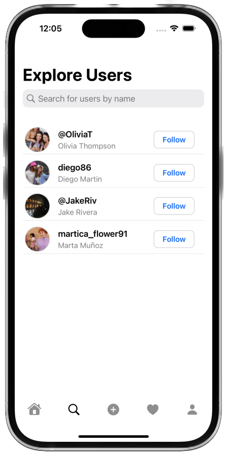
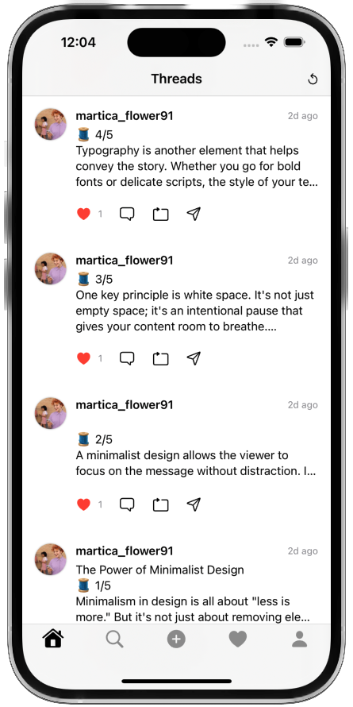
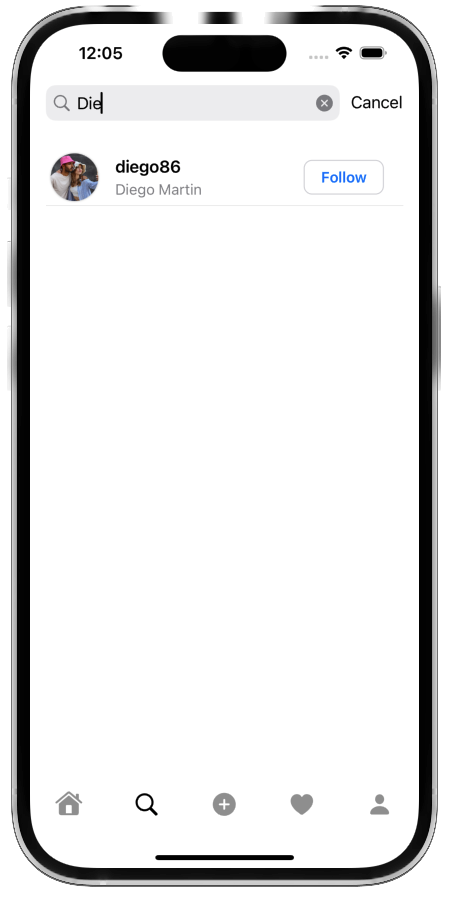

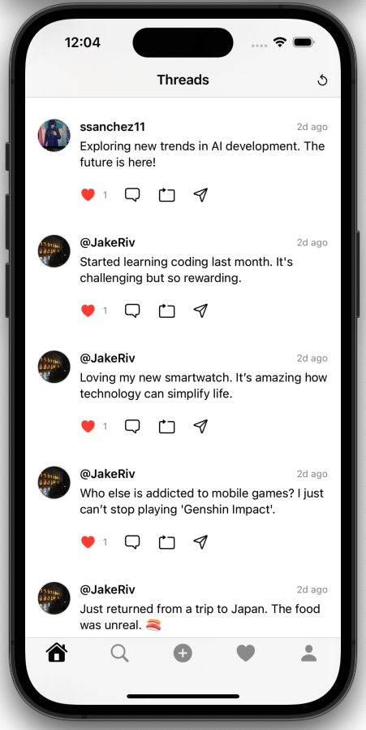
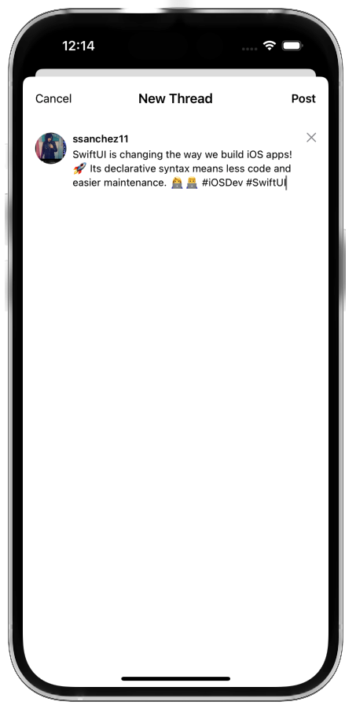
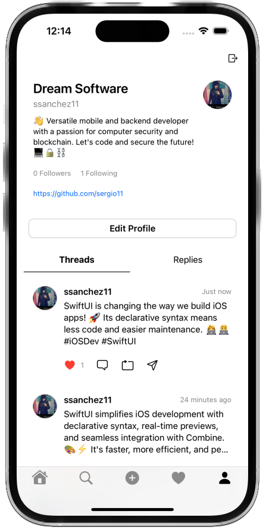

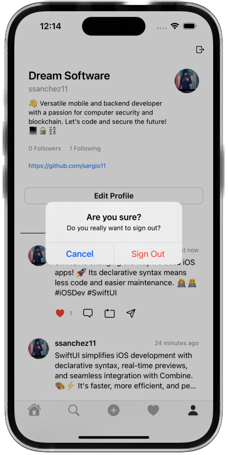
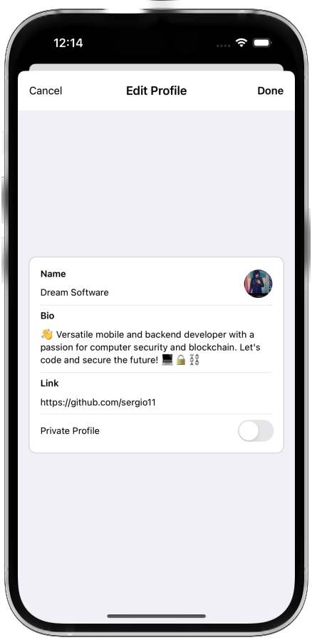
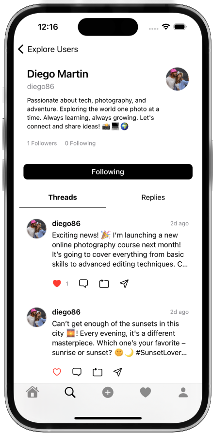

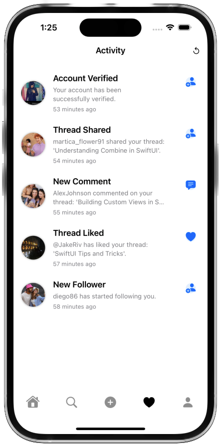
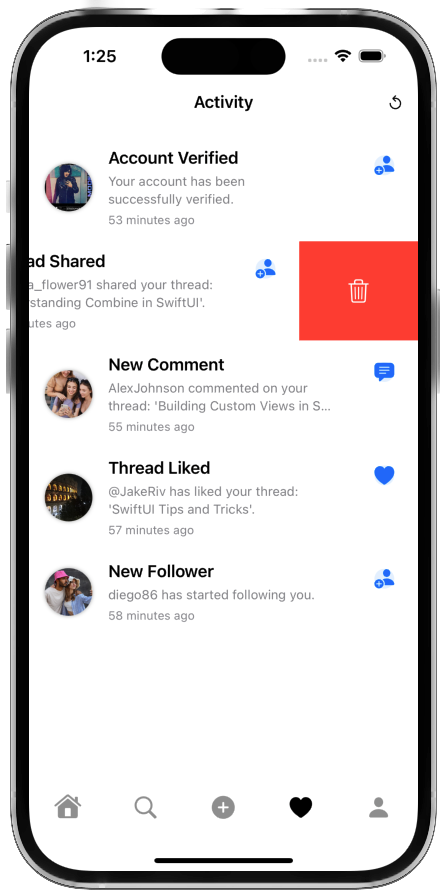

## Contributing 🤝

Contributions are welcome! If you'd like to contribute to ThreadsSwiftUI, please fork the repository and create a pull request with your changes.

## Support 💬

For support, bug reports, or feature requests, please open an issue on the GitHub repository.

## License 📄

ThreadsSwiftUI is available under the MIT License. See the [LICENSE](LICENSE) file for more information.

## Acknowledgements 🙏

ThreadsSwiftUI is inspired by the functionality and design of Threads from Meta.

We express our deep appreciation to [Freepik](https://www.freepik.es/) for generously providing the resources used in this project.

 ## Visitors Count

## Please Share & Star the repository to keep me motivated.

Template mockup from https://previewed.app/template/AFC0B4CB
