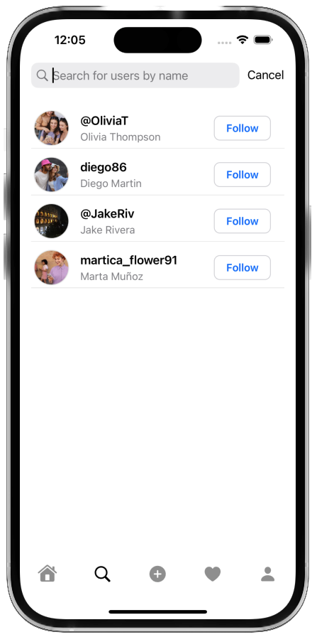

# 🧵 Threads SwiftUI


Welcome to **Threads SwiftUI**, an engaging application designed for iOS 17 to share thoughts and comment on hot and trending topics! Developed using SwiftUI and following Clean Code architecture, this app ensures a seamless and intuitive user experience.

<p align="center">
  
  
  
  
  
</p>

## 📱 Purpose and Description

**Threads SwiftUI** is a platform where users can freely express their opinions, follow other users, and engage with various threads by liking and commenting. This app leverages Firebase services to provide a robust backend infrastructure for authentication, data storage, and real-time updates.

## 🚀 Features

- **Create New Threads**: Share your thoughts and start conversations on topics that matter to you.
- **Follow Users**: Stay updated with threads from users you follow.
- **Like Threads**: Show appreciation by liking threads that resonate with you.
- **Comment on Threads**: Engage in discussions by commenting on threads.
- **Real-Time Updates**: Experience seamless real-time updates with Firestore.

## 🛠️ Architecture

Threads SwiftUI is built using the **Clean Code** architecture, ensuring maintainable and scalable code. Here’s a brief overview of the architecture components:

- **Use Cases**: Encapsulate the business logic and define the actions the app can perform.
- **Repositories**: Provide a clean API for data access and manipulation.
- **Data Sources**: Manage data from various sources such as remote APIs (Firebase) and local storage.

## 🔧 Technologies

- **SwiftUI**: For building the user interface.
- **Firebase Authentication**: For secure user authentication.
- **Firestore**: For real-time database and data synchronization.
- **Firebase Storage**: For storing user-generated content.

## App Screenshots

Here are some screenshots from our app to give you a glimpse of its design and functionality.


</br>



</br>


</br>


## 📦 Installation

1. Clone the repository:
   ```bash
   git clone https://github.com/yourusername/threads-swiftui.git

Navigate to the project directory

:cd threads-swiftuiOpen the project in Xcode:open ThreadsSwiftUI.xcodeprojInstall dependencies using Swift Package Manager (SPM).
Configure Firebase by adding your GoogleService-Info.plist file to the project.

💬 Feedback and ContributionsWe welcome feedback and contributions! Feel free to open issues or submit pull requests.

📝 LicenseThis project is licensed under the MIT License - see the LICENSE file for details.
